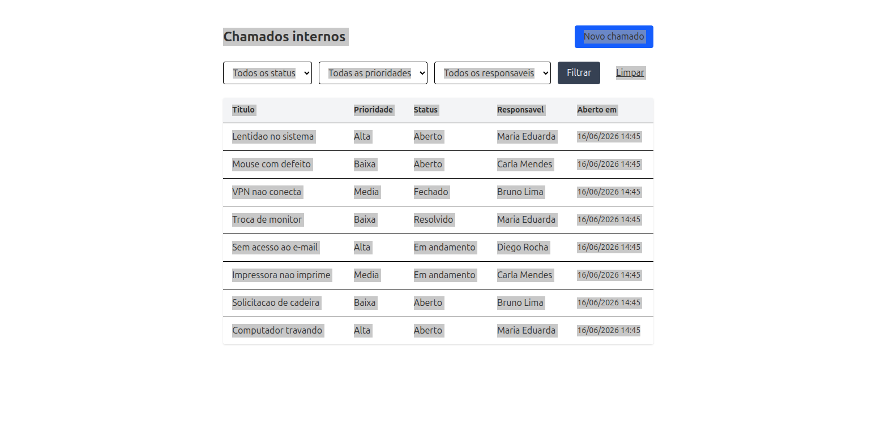

# Sistema de Controle de Chamados Internos

Aplicação web para abertura e acompanhamento de chamados internos, com
distribuição automática de responsáveis. Desenvolvida como desafio técnico.



## Stack

- **Ruby on Rails 8** (Ruby 3.2.2)
- **PostgreSQL 16** (via Docker)
- **Hotwire** (Turbo + Stimulus) — interface sem API separada
- **Tailwind CSS** — estilização
- **RSpec + FactoryBot** — testes

## Por que estas escolhas

**Rails + Hotwire.** O desafio sugere reduzir o atrito entre frontend e
backend. Hotwire é a resposta do Rails para isso: as telas são renderizadas
no servidor e entregues como HTML, sem precisar de uma API REST separada
consumida por um SPA. Um único desenvolvedor entrega a funcionalidade
completa (model, controller e view), o que faz sentido para uma equipe
pequena — exatamente o cenário descrito no enunciado.

**Service object para a distribuição automática.** A regra de "atribuir ao
responsável com menos chamados em aberto" mora em uma classe dedicada
(`app/services/ticket_assignment_service.rb`), e não no controller ou no
model. Isso isola a regra de negócio, deixa ela testável de forma isolada e
segue o princípio da responsabilidade única (SRP).

**Definição de "em aberto" (item 4.3).** Considero "em aberto" os chamados
com status `aberto` ou `em_andamento`. Chamados `resolvido` ou `fechado` já
saíram da fila de trabalho e não pesam na carga de ninguém, portanto não
contam para a distribuição. Essa regra fica centralizada no scope
`Ticket.active` — muda em um único lugar se a definição mudar (DRY).

**Tratamento de responsável sem chamados.** A consulta usa `LEFT JOIN` para
que um responsável com zero chamados ativos seja considerado na distribuição
(ele é justamente quem deve receber o próximo). Um `JOIN` comum o excluiria
da contagem.

## Modelo de dados

- **Agent** — responsável pelo atendimento (`name`).
- **Ticket** — chamado, com `title`, `description`, `priority` (baixa,
  média, alta), `status` (aberto, em andamento, resolvido, fechado),
  `agent` (responsável) e data de abertura. Todo chamado exige um
  responsável (`null: false` no banco e validação no model).

Prioridade e status são `enum` (inteiros no banco, nomes no código): mais
rápido, indexável e com métodos de consulta prontos.

## Como rodar

Pré-requisitos: Ruby 3.2.2, Docker e Docker Compose.

```bash
# 1. Instalar dependências
bundle install

# 2. Subir o PostgreSQL
docker compose up -d

# 3. Criar e popular o banco
bin/rails db:create db:migrate db:seed

# 4. Subir a aplicação (Rails + Tailwind)
bin/dev
```

Acesse `http://localhost:3000`.

> O `docker-compose.yml` expõe o Postgres na porta 5435 para evitar conflito
> com outras instâncias locais. O `config/database.yml` usa essa porta por
> padrão, mas respeita a variável de ambiente `DB_PORT` caso queira ajustar
> (ex: `DB_PORT=5432 bin/rails db:create`).

## Funcionalidades

- Cadastro, edição, listagem e visualização de chamados.
- Listagem com filtros por status, prioridade e responsável.
- Atribuição manual (no formulário) ou automática (botão na tela do
  chamado) do responsável.
- Distribuição automática para o responsável com menos chamados ativos.

## Testes

```bash
bundle exec rspec
```

A suíte cobre as validações do modelo, a regra do "em aberto"
(scope `active`) e os cenários da distribuição automática: menor carga,
responsável com zero chamados, desempate e exclusão de chamados concluídos.
